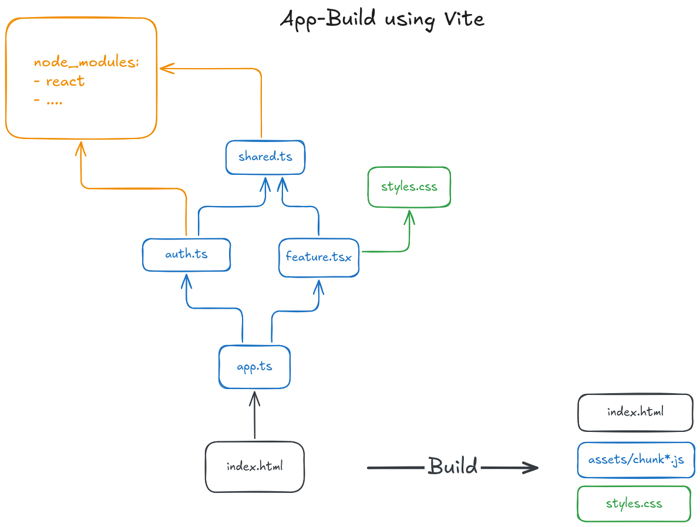
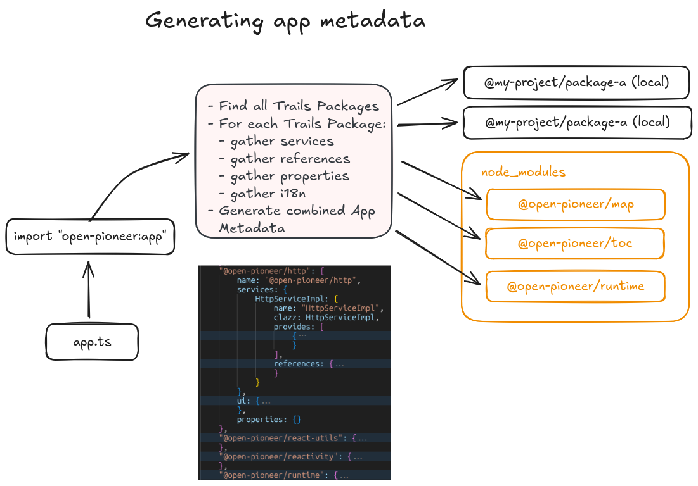

# Build process

This document explains how a Trails project is compiled.
It assumes that you already have detailed knowledge about Trails from a _user's_ point of view.

Only the high level concepts are covered here.
Details live in the source code of the [build tools repository](https://github.com/open-pioneer/trails-build-tools).
See [Build Tools Repository](#build-tools-repository) for a brief overview.

## Build tools repository

### Public packages

These packages are used directly in a Trails project:

- **`@open-pioneer/build-support`**

    Defines the `defineBuildConfig` function used by every `build.config.mjs`.
    The function itself is trivial, the important bit are its types: they define the schema of the configuration object and give the developer documentation and autocompletion.

- **`@open-pioneer/vite-plugin-pioneer`**

    The central Vite plugin required by our framework, configured in the project's `vite.config.ts`.
    It does most of the heavy lifting when it comes to application metadata and code generation.

- **`@open-pioneer/build-package-cli`**

    Implements the `build-pioneer-package` CLI tool, which compiles a package into a publishable form.

### Internal packages

- **`@open-pioneer/build-package`**

    The implementation behind `build-pioneer-package`.
    It is a library that could, in theory, be used to script the build process.
    For now it is only an internal artifact.

- **`@open-pioneer/build-common`**

    Code shared by the Vite plugin and the package compiler.
    Reading and validation of the `build.config.mjs` are implemented here, as well as the package metadata format (`openPioneerFramework`) written by `build-pioneer-package` and read by the Vite plugin.

## Build overview

There are two different ways in which Trails code gets compiled:

1. **Building and developing an app.**

    A Trails project is a [Vite](https://vite.dev) project.
    Our Vite plugin (`@open-pioneer/vite-plugin-pioneer`) runs inside `vite dev` and `vite build`.
    When building for production: the result is a set of static files (HTML, JavaScript, CSS) in `dist/www`.
    This step is used by every project.

2. **Building a package for publishing.**

    The `build-pioneer-package` CLI compiles a single package into a publishable form (a `dist` directory that is uploaded with `pnpm publish`).
    This is also called _separate compilation_.
    It only happens when a package is shared with other projects.

Both paths read the same inputs (`package.json` and `build.config.mjs` of each package) and share code in the internal `build-common` package.

## Building and developing an app

A Trails project is a [Vite](https://vite.dev) project that uses [`vite-plugin-pioneer`](https://www.npmjs.com/package/@open-pioneer/vite-plugin-pioneer) to implement the specifics of the framework.

Vite handles:

- Gathering JavaScript/TypeScript modules from the project and its dependencies
- Gathering styles and static assets
- Transforming React JSX to JavaScript (via the `react()` plugin)
- Compiling and bundling everything into a set of static files in `dist/www`

The following image shows how vite bundles source files into a bundled application:



`vite-plugin-pioneer` _extends_ Vite as a plugin to support the features that are specific to Open Pioneer Trails.
It runs within `vite build` and `vite dev`, using the plugin hooks supported by Vite.
It is preconfigured in every Trails project and is required to build apps.

The plugin provides everything that Trails packages need at runtime:

- Services needed by the application, and how they reference each other
- All i18n messages per locale
- All styles from all packages
- All properties from all packages

### App metadata

All of these entities are made available through a single import, which is present in every `app.ts`:

```ts
import * as appMetadata from "open-pioneer:app"; // import app metadata
import { createCustomElement } from "@open-pioneer/runtime";

const Element = createCustomElement({
    appMetadata // Everything the app needs to know about itself at runtime
});
```

`open-pioneer:app` is a _virtual_ module: it does not exist on disk.
The plugin generates its content for the app that imports it.

To do so, the plugin starts from the `app.ts` that contains the import, inspects its dependencies (and their dependencies, and so on) and aggregates everything that the application needs to know about itself.
Every app can have a different set of dependencies and different local overrides, so the content of the module differs from app to app.

Note that `appMetadata` only contains metadata about _Trails_ packages: plain node packages are ignored.



The runtime (`@open-pioneer/runtime`) consumes this object to create the service layer: service instances, references, properties and so on.
See [Service layer](./ServiceLayer.md) for the runtime side.

The example below shows what the generated module looks like.
The exact format is an implementation detail shared between the plugin and the runtime, it is not a public API.

<details>
<summary>
Example output of importing "open-pioneer:app"
</summary>

```ts
import { MainMapProvider } from "ol-app/services";
import { MapRegistry, LayerFactory } from "@open-pioneer/map/services";
import { HttpServiceImpl } from "@open-pioneer/http/services";

// Package metadata
export const packages = {
    "ol-app": {
        "name": "ol-app",
        "services": {
            "MainMapProvider": {
                "name": "MainMapProvider",
                "clazz": MainMapProvider,
                "provides": [
                    {
                        "name": "map.MapConfigProvider",
                        "qualifier": void 0
                    }
                ],
                "references": {}
            }
        },
        "ui": { "references": [] },
        "properties": {}
    },
    "@open-pioneer/map": {
        "name": "@open-pioneer/map",
        "services": {
            "MapRegistry": {
                "name": "MapRegistry",
                "clazz": MapRegistry,
                "provides": [
                    {
                        "name": "map.MapRegistry",
                        "qualifier": void 0
                    }
                ],
                "references": {
                    "providers": {
                        "name": "map.MapConfigProvider",
                        "qualifier": void 0,
                        "all": true
                    },
                    "httpService": {
                        "name": "http.HttpService",
                        "qualifier": void 0,
                        "all": false
                    },
                    "layerFactory": {
                        "name": "map.LayerFactory",
                        "qualifier": void 0,
                        "all": false
                    }
                }
            },
            "LayerFactory": {
                "name": "LayerFactory",
                "clazz": LayerFactory,
                "provides": [
                    {
                        "name": "map.LayerFactory",
                        "qualifier": void 0
                    }
                ],
                "references": {
                    "httpService": {
                        "name": "http.HttpService",
                        "qualifier": void 0,
                        "all": false
                    }
                }
            }
        },
        "ui": {
            "references": [
                {
                    "name": "map.MapRegistry",
                    "qualifier": void 0,
                    "all": false
                }
            ]
        },
        "properties": {}
    },
    "@open-pioneer/core": {
        "name": "@open-pioneer/core",
        "services": {},
        "ui": { "references": [] },
        "properties": {}
    },
    "@open-pioneer/http": {
        "name": "@open-pioneer/http",
        "services": {
            "HttpServiceImpl": {
                "name": "HttpServiceImpl",
                "clazz": HttpServiceImpl,
                "provides": [
                    {
                        "name": "http.HttpService",
                        "qualifier": void 0
                    }
                ],
                "references": {
                    "interceptors": {
                        "name": "http.Interceptor",
                        "qualifier": void 0,
                        "all": true
                    }
                }
            }
        },
        "ui": { "references": [] },
        "properties": {}
    }
    // ...
};

// Application styles (from .(s)css files).
export const styles = "...";

// List of supported locales
export const locales = ["de", "en"];

// Asynchronous function to load the i18n messages for the given locale
export function loadMessages(locale) {
    // ...
}
```

</details>

### Other virtual modules

The Vite plugin implements a few additional virtual modules.
These play a much smaller role, and their implementation is quite simple compared to `open-pioneer:app`.

- `open-pioneer:react-hooks` provides the React hooks that interact with the framework (`useService`, `useIntl`, ...).
  Their generation is trivial: only the current package name is needed, the generated functions are otherwise simple wrappers around the [(internal) hooks](https://github.com/open-pioneer/trails-core-packages/blob/18b9eed1d9a5d75d4d33ff55245a915d25a9805c/src/packages/runtime/react-integration/hooks.ts) in the `@open-pioneer/runtime` package.
- `open-pioneer:deployment` provides metadata about the deployment environment (e.g. the application's base URL).
- `open-pioneer:source-info` returns the `sourceId` of a module (e.g. `@open-pioneer/package-name/path/to/module`).

### How code generation works

The virtual modules listed above depend on the current state of the trails project (or app, or package) where they are used.
Their content is derived from many files on disk (e.g. `package.json`, `build.config.mjs`), but they never materialize on disk themselves.
Their content is generated when they are needed by Vite:

- Vite sees an import into a virtual module, for example `open-pioneer:app`.
- Vite calls the `resolveId` hook(s) of its plugins in order to find it.
  Our codegen plugin runs and returns with a result.
  If no plugin were to return a valid result, Vite would attempt to locate the file on disk, which would produce an error.
- Vite then calls the `load` hook for the resolved module in order to read its source code (JavaScript).
  This is done _once_ during build or after every relevant _change_ during dev (which is why caching is important here).
  Our codegen plugin generates the required data structures (e.g. `packages`) and then outputs JavaScript code.
- The resulting code is used by Vite just like any other file it would ordinarily read from disk.

The hooks are implemented here: [resolveId](https://github.com/open-pioneer/trails-build-tools/blob/ab735175fa97e4328c56a2b6e5b538aa0e740539/packages/vite-plugin/src/codegenPlugin.ts#L62), [load](https://github.com/open-pioneer/trails-build-tools/blob/ab735175fa97e4328c56a2b6e5b538aa0e740539/packages/vite-plugin/src/codegenPlugin.ts#L116) in `codegenPlugin.ts`:

- `resolveId` determines which package does the import (by locating the nearest `package.json`) and maps the public module name to an internal, package specific id.
- `load` generates the code for the resolved id.

The basic process is the same for almost all virtual modules:

1. Determine which app (or package) does the import.
2. Access the relevant metadata (package names, services within packages, locales, ...).
3. Generate the requested code (service metadata, combined app CSS, ...).
   The code is returned as a string that contains valid JavaScript, ready to be read by Vite.

The metadata needed by the various virtual modules is cached within the `MetadataRepository`.
The goal is to compute metadata for packages when needed, once, and then reuse the values for as long as they are valid.
This is important to keep the dev server fast (`pnpm dev`).
It has no benefit for the real build (`pnpm build`), but it is useful to keep the code paths as similar as possible for maintainability.

### Walkthrough: generating `open-pioneer:app`

This section traces the steps above for a single, concrete import of `open-pioneer:app`.
The goal is to show how the pieces introduced so far (virtual modules, plugin hooks, metadata, code generation) fit together.

Consider a minimal app:

```ts
// src/apps/my-app/app.ts
import * as appMetadata from "open-pioneer:app";
import { createCustomElement } from "@open-pioneer/runtime";

const Element = createCustomElement({
    appMetadata
});

customElements.define("my-app", Element);
```

`createCustomElement` is an ordinary function.
It expects the application's metadata in a certain shape (see its typings), but it does not care where that object comes from.
In a real app, the object is always produced by the Vite plugin.
The tests of the runtime package construct them by hand.

**Step 1: Resolving the import.**
When Vite encounters the import of `open-pioneer:app`, it calls the `resolveId` hook of our plugin.
The plugin locates the nearest `package.json` of the importing file (in this case: `my-app/package.json`) and returns an internal id that encodes the app's package directory.
This is the _dynamic_ part: the same public module name resolves to a different id for every app, because its content depends on the importing package.

**Step 2: Gathering metadata.**
Vite then calls the `load` hook for the resolved id.
The plugin retrieves the app's metadata from the `MetadataRepository`.
If it is not cached yet, the repository reads the app's `package.json` and `build.config.mjs`, then walks the declared dependencies (and their dependencies, and so on), collecting the metadata of every Trails package it finds.
Plain node packages are skipped.
The result describes the entire application: all Trails packages, their services and references, their styles, their i18n files and their properties.

**Step 3: Generating the outer module.**
The module behind `open-pioneer:app` is very short by itself.
It only imports and re-exports a set of "inner" helper modules and contains the hot module replacement ([HMR](https://vite.dev/guide/api-hmr)) logic (omitted below).
The helper modules exist for organization and for more efficient HMR: a change to an i18n `.yaml` file only invalidates the i18n module, not the whole app metadata.
They cannot be imported by user code.

```js
// Simplified content of "open-pioneer:app" for `my-app`.
// Module ids and the metadata format are implementation details and may change at any time.
import { createBox } from "@open-pioneer/runtime/metadata";
import packages from "/src/apps/my-app/@@open-pioneer-app?open-pioneer-packages";
import stylesString from "/src/apps/my-app/@@open-pioneer-app?open-pioneer-styles&inline&lang.css";
import { locales, loadMessages } from "/src/apps/my-app/@@open-pioneer-app?open-pioneer-i18n-index";

const styles = createBox(stylesString);

export { packages, styles, locales, loadMessages };
```

Each helper module is a virtual module in its own right and goes through the same `resolveId` / `load` cycle.
The `load` hook of each helper reuses the (now cached) app metadata from step 2 and only performs the code generation for its part.

| Helper module    | Content                                                                                                                           |
| ---------------- | --------------------------------------------------------------------------------------------------------------------------------- |
| `app-packages`   | Metadata of all Trails packages in the app (services, references, properties), including class imports from `services` modules.   |
| `app-css`        | The aggregated CSS of all packages.                                                                                               |
| `app-i18n-index` | The list of supported locales and a `loadMessages(locale)` function that loads the actual messages for a locale (see `app-i18n`). |
| `app-i18n`       | Parameterized by locale. A JSON string with all `(key, message)` pairs of that locale, grouped by package.                        |

**Step 4: The helper modules.**
Together, the helper modules produce the four exports of `open-pioneer:app`.

- **`packages`** (from `app-packages`)

    A JSON-like structure with one entry per Trails package in the app.
    Each entry lists the package's service definitions (with their `provides` and `references`), the services referenced by its UI and its properties.
    Service classes are imported from the packages' `services` modules and placed directly into the structure, so the runtime can instantiate them without any further lookup.
    The [Service layer](./ServiceLayer.md) uses this data to start all required services.
    See the example output in [App Metadata](#app-metadata).

- **`styles`** (from `app-css`)

    The plugin generates a small CSS module that `@import`s the stylesheet of every package (if they have one).
    Vite processes this module like any other CSS file (resolving imports, compiling SCSS, ...).
    The runtime later places the resulting CSS code into the app's shadow root.

- **`locales` and `loadMessages`** (from `app-i18n-index`)

    The set of supported locales is read from the app's `build.config.mjs` and exported as an array.
    The runtime uses it to pick the application's locale and then calls `loadMessages(locale)` to fetch the messages for that locale.

    ```js
    // Locales supported by the application
    export const locales = ["de", "en"];

    // Lazily loads the messages for the given locale
    export function loadMessages(locale) {
        switch (locale) {
            case "de":
                return import("/src/apps/my-app/@@open-pioneer-app?open-pioneer-i18n&locale=de").then(
                    (mod) => mod.default
                );
            case "en":
                return import("/src/apps/my-app/@@open-pioneer-app?open-pioneer-i18n&locale=en").then(
                    (mod) => mod.default
                );
        }
        throw new Error(`Unsupported locale: '${locale}'`);
    }
    ```

    `loadMessages` contains one [dynamic import](https://developer.mozilla.org/en-US/docs/Web/JavaScript/Reference/Operators/import) per locale, pointing to the parameterized `app-i18n` module.
    Because the imports are dynamic, Vite emits a separate chunk per locale and the browser only downloads the messages that are actually needed.

    The `app-i18n` module for `en` looks like this:

    ```js
    // Messages for locale 'en', keyed by package name and message id
    const messages = JSON.parse(
        `{"my-app":{"content.header":"My App","content.description":"..."},"@open-pioneer/map":{"...":"..."}}`
    );
    export default messages;
    ```

    The plugin merges the messages of every package into a single JSON structure, applying any `overrides` declared by the app on the way.
    The runtime feeds this structure into the i18n framework.

**Summary.**
From Vite's point of view, our plugin just adds a few virtual modules that are imported from application code.
Everything else (bundling, CSS processing, code splitting, hot module replacement, ...) is handled by Vite.
Most of the complexity inside the plugin comes from parsing, validating and caching the metadata that feeds the code generation, not from the code generation itself.

## Building a package for publishing

TODO

## Code pointers

This section contains a few pointers into the most relevant parts of the implementation.

> NOTE: These are permalinks to a specific revision. They may become out of date. If you notice that they are no longer helpful: update them.

### Vite plugin

- The file [`codegenPlugin.ts`](https://github.com/open-pioneer/trails-build-tools/blob/ab735175fa97e4328c56a2b6e5b538aa0e740539/packages/vite-plugin/src/codegenPlugin.ts) contains the main Vite plugin and implements the generation of every virtual module.
- The [`metadata` directory](https://github.com/open-pioneer/trails-build-tools/tree/ab735175fa97e4328c56a2b6e5b538aa0e740539/packages/vite-plugin/src/metadata) is responsible for _parsing_ and _caching_ application / package metadata.
    - The [`MetadataRepository`](https://github.com/open-pioneer/trails-build-tools/blob/ab735175fa97e4328c56a2b6e5b538aa0e740539/packages/vite-plugin/src/metadata/MetadataRepository.ts#L53) is the main class used by the rest of the plugin.
      It lazily computes (and caches) metadata and i18n objects.
    - Package metadata is read in [`loadPackageMetadata`](https://github.com/open-pioneer/trails-build-tools/blob/ab735175fa97e4328c56a2b6e5b538aa0e740539/packages/vite-plugin/src/metadata/loadPackageMetadata.ts#L41)
    - The actual parsing and validation logic is imported from `@open-pioneer/build-common` (see below)
- The [`codegen` directory](https://github.com/open-pioneer/trails-build-tools/tree/ab735175fa97e4328c56a2b6e5b538aa0e740539/packages/vite-plugin/src/codegen) implements the generation of JavaScript code, used to output the virtual `open-pioneer:*` modules.
    - [`generateAppMetadata`](https://github.com/open-pioneer/trails-build-tools/blob/ab735175fa97e4328c56a2b6e5b538aa0e740539/packages/vite-plugin/src/codegen/generateAppMetadata.ts#L11) (for `open-pioneer:app`) is based on a simple string template; the actual data structures are generated in other files.
    - [`generatePackagesMetadata`](https://github.com/open-pioneer/trails-build-tools/blob/ab735175fa97e4328c56a2b6e5b538aa0e740539/packages/vite-plugin/src/codegen/generatePackagesMetadata.ts#L41) outputs the large `packages` data structure (with one object per Trails package).

### Build package CLI

### Common

- Reading (and validation) of `build.config.mjs` happens [here](https://github.com/open-pioneer/trails-build-tools/tree/ab735175fa97e4328c56a2b6e5b538aa0e740539/packages/build-common/src/buildConfig)
- Metadata read from (or written to) `package.json` files (for Trails packages in `node_modules`) is implemented [here](https://github.com/open-pioneer/trails-build-tools/blob/ab735175fa97e4328c56a2b6e5b538aa0e740539/packages/build-common/src/packageMetadata/v1.ts).
- The [`PackageConfig` type](https://github.com/open-pioneer/trails-build-tools/blob/ab735175fa97e4328c56a2b6e5b538aa0e740539/packages/build-common/src/packageConfig/index.ts#L22) abstracts over the `build.config.mjs` and the metadata from `package.json` so that both can be treated the same by the Vite plugin.
- A few helpers that are relevant during code generation are located in [`runtimeSupport`](https://github.com/open-pioneer/trails-build-tools/blob/ab735175fa97e4328c56a2b6e5b538aa0e740539/packages/build-common/src/runtimeSupport/index.ts).
  These are needed by the Vite plugin and by `build-pioneer-package`.

## Debugging

Use the `DEBUG` environment variable to enable debug logs for our plugin and the `build-pioneer-package` CLI.

For example:

```sh
$ DEBUG=open-pioneer:* pnpm build
$ DEBUG=open-pioneer:* pnpm dev
```

Before Vite 8, Vite itself also respected this environment variable (`DEBUG=* pnpm build` showed _everything_).
Since Vite 8, much of Vite and Rolldown is written in Rust, which needs different configuration:

- Vite 8 supports a `-d` flag to show debug logs, but its output is very sparse at this time.
- Rolldown (Vite's bundler) supports [tracing and logging](https://rolldown.rs/development-guide/tracing-logging) options.

## Further reading

- [Build tools repository](https://github.com/open-pioneer/trails-build-tools)
- [Rollup's plugin API](https://rollupjs.org/plugin-development/)
- [Vite's plugin API](https://vitejs.dev/guide/api-plugin.html)
- [Vite's HMR API](https://vitejs.dev/guide/api-hmr.html)
- [Rolldown](https://rolldown.rs)
- [How to publish a package](../tutorials/HowToPublishAPackage.md)
- [Package reference](../reference/Package.md)
- [Service layer](./ServiceLayer.md)
- [React integration](./ReactIntegration.md)
