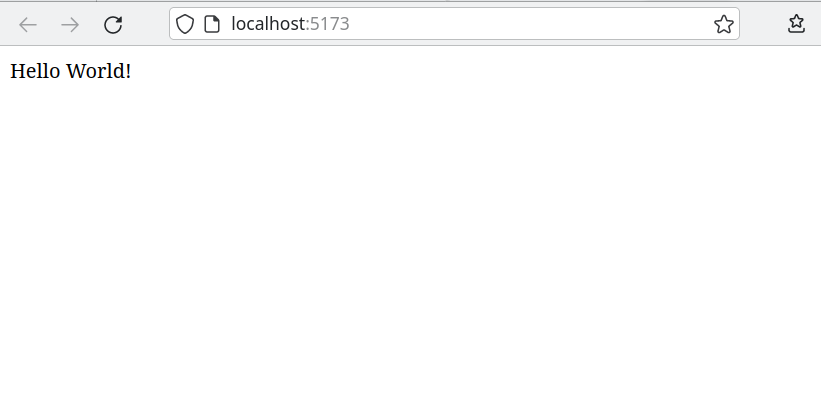

# App Development

> NOTE: This document is a work in progress.
> It will be continuously updated during development.

An app is a JavaScript (or TypeScript) package that provides a web component.
The web component can in turn be used within an html file in the same project.
It can also be distributed on its own to be embedded into different host sites.

## Creating an app

To create a new app, first create a new empty directory in `src/apps`, for example `src/apps/my-app`.
Pioneer apps are node packages to benefit from npm's dependency management.
Thus, every app needs a [`package.json`](https://docs.npmjs.com/cli/v9/configuring-npm/package-json) file such as this:

```json
// src/apps/my-app/package.json
{
    "name": "my-app",
    "private": true,
    "dependencies": {
        "@open-pioneer/runtime": "workspace:^"
    }
}
```

A `package.json` file should always contain at least a `name`, some `dependencies` and either `private: true` or a valid license (in case you intend to publish it).
After creating a new package or modifying the dependencies of an existing package, you should run `pnpm install`.

To create a web component with a simple UI, call the `createCustomElement` function from the `@open-pioneer/runtime` package:

```ts
// src/apps/my-app/app.ts
import { createCustomElement } from "@open-pioneer/runtime";
import { AppUI } from "./AppUI";

const Element = createCustomElement({
    component: AppUI
});
customElements.define("my-app-element", Element);
```

```tsx
// src/apps/my-app/AppUI.tsx
export function AppUI() {
    return <div>Hello World!</div>;
}
```

The main entry point of an app should always be called `app.<EXT>`, where `EXT` can be one of `js`, `ts`, `jsx` or `tsx`.
The file above defines a custom component called `my-app-element` that can now be used in an `.html` file:

```html
<!-- src/index.html -->
<!DOCTYPE html>
<html lang="en">
    <head>
        <meta charset="UTF-8" />
        <meta name="viewport" content="width=device-width, initial-scale=1.0" />
        <title>Demo</title>
    </head>
    <body>
        <my-app-element></my-app-element>
        <script type="module" src="apps/my-app/app.tsx"></script>
    </body>
</html>
```

Finally, launch the development server and inspect the result:

```sh
$ pnpm install
$ pnpm run dev
VITE v4.0.4  ready in 518 ms

  ➜  Local:   http://localhost:5173/
  ➜  Network: use --host to expose
  ➜  press h to show help
```



## Concepts: Apps and Sites

An _app_ is a package that exposes a web component.
The web component can be published on its own (for consumption from a host site) or it can be embedded into a _site_.

_Sites_ are plain old `.html` pages (with associated assets) that can also be developed within this project,
for example to implement a full screen application or to test apps in different configurations.
By convention, sites are located under `src/sites/<SITE_NAME>/index.html`.

You can choose which sites or apps should be part of your deployment by editing pioneer plugin configuration in the `vite.config.ts` file:

```js
pioneer({
    // Include src/index.html
    rootSite: true,

    // Include apps
    apps: ["sample1", "sample2"],

    // Only include example-site if building for test deployment
    sites: testing && ["example-site"]
}),
```

See the documentation of the package `@open-pioneer/vite-plugin-pioneer` for more details.

## Deployment

Running `pnpm run build` will package the project into the `dist` directory as a static website according to the configuration in `vite.config.ts`.
The contents of the `dist` directory can be deployed to an arbitrary web server.

As an example for a fully automated deployment, open the `test-and-build.yml` Github Actions Workflow file.
The workflow automatically builds the project and deploys the result to Github Pages.
