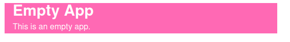

# How to add custom styles

In this example, we will enhance the empty app (at `src/apps/empty`) to include custom css rules.
We intend to add a custom class to the app's container and define that class in a `.css` file.

> **Note**  
> The same technique can be applied to every other package in this repository (app or package).

## Distributing styles with your package

To begin, start the development server and open the empty app:

```bash
pnpm run dev
```

Open the `build.config.mjs` and declare the `styles` property:

```js
// src/apps/empty/build.config.mjs
import { defineBuildConfig } from "@open-pioneer/build-support";

export default defineBuildConfig({
    styles: "./styles.css"
});
```

The framework will automatically gather all css rules of packages that declare `styles` and distribute them with your application.
After hitting save, you will now get an (expected) error in your browser, since the file does not yet exist.

Now create it:

```css
/* src/apps/empty/styles.css */

.empty-app-container {
    background-color: hotpink;
    color: white;
}
```

After reloading your browser, the previous error will be gone.
However, since the class isn't being used, your UI still looks the same.
Setting the css class of a React element is done via the `className` prop:

```tsx
import { Container, Heading, Text } from "@open-pioneer/chakra-integration";

export function AppUI() {
    return (
        <Container className="empty-app-container">
            <Heading as="h1" size="lg">
                Empty App
            </Heading>
            <Text>This is an empty app.</Text>
        </Container>
    );
}
```

Now hit save.
Your browser should show the new styles immediately:



### Support for SCSS

You can also use [SCSS](https://sass-lang.com/) to develop your stylesheets.

For example:

```js
// src/apps/empty/build.config.mjs
import { defineBuildConfig } from "@open-pioneer/build-support";

export default defineBuildConfig({
    styles: "./styles.scss" // Note the .scss extension
});
```

The following scss file is equivalent to the css file from above:

```scss
/* src/apps/empty/styles.scss */

.empty-app {
    &-container {
        background-color: hotpink;
        color: white;
    }
}
```

## Advanced styling

### Hot reloading

Changing the content of your package's css files will automatically apply those changes _without_ reloading the app (hot update).

### CSS imports

You can use [CSS imports](https://developer.mozilla.org/en-US/docs/Web/CSS/@import) to split large files or to integrate external libraries.
Imports will be resolved by the framework and contents will be merged without any impact on production performance.

Example:

```css
/* Imports a package-local file. */
@import "./other/css/file.css";

/* This is how the open layers styles are included internally (imports from `ol` package). */
@import "ol/ol.css";
```

### Applying styles to your UI Components

This section contains a few hints and examples for different ways to style your UI components.

#### Chakra UI

Chakra UI already comes with a very large set of properties to customize single components: [Documentation](https://chakra-ui.com/docs/styled-system/style-props).

Chakra also provides extensive support theming ([Documentation](https://chakra-ui.com/docs/styled-system/theme)).
The theme of the entire application does not support configuration at this time (please submit a feature request!), but it can be customized by directly editing the chakra provider in `@open-pioneer/chakra-integration/Provider.tsx`.

#### React classes

React supports the `className` prop to set an element's css classes as a string ([Documentation](https://reactjs.org/docs/faq-styling.html)).

The popular [`classnames`](https://www.npmjs.com/package/classnames) packages can be used to assemble the `className` prop from multiple, potentially dynamic inputs:

```tsx
import classNames from "classnames";

export function AppUI() {
    return (
        <div className={classNames("foo", "bar", { baz: false, qux: 5 * 2 === 10 })}>
            <h1>Hello world</h1>
        </div>
    );
}
```

The `div` will have the css classes `foo`, `bar` and `qux` but not `baz`, because it has been set to false.

#### Emotion

Chakra UI is based on [Emotion](https://emotion.sh/docs/introduction), a library that allows you to define css styles from JavaScript.
Using inline styles can be a powerful tool for ad-hoc styling or complex dynamic styles, however they can have some negative impact on performance.

For example:

```tsx
import { Container, Heading, Text } from "@open-pioneer/chakra-integration";
import { css } from "@emotion/react";

export function AppUI() {
    return (
        <Container
            css={css`
                background-color: hotpink;
                font-size: 200%;
            `}
        >
            <Heading as="h1" size="lg">
                Empty App
            </Heading>
            <Text>This is an empty app.</Text>
        </Container>
    );
}
```

See also the [Documentation of `@emotion/react`](https://emotion.sh/docs/@emotion/react).

#### React inline styles

You can also use React's builtin support for the `style` property.
Styles defined this way appear as inline styles directly on the DOM element:

```tsx
export function AppUI() {
    return (
        <div>
            <h1 style={{ padding: "10px 20px", textAlign: "center", color: "green" }}>Header</h1>
        </div>
    );
}
```

Inline styles have a lot of downsides (maintainability, performance, no reuse) but they can sometimes be appropriate to apply dynamic styles.
