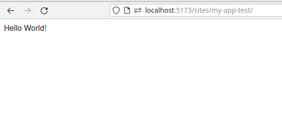

# How to create an app

An app is a JavaScript or TypeScript package that provides a web component.
The web component can in turn be used within a html file in the same project.
It can also be distributed on its own to be embedded into different host sites.

This repository comes prepared with an empty app in `src/apps/empty`, which is embedded into the site at `src/sites/empty/index.html`.

## Required setup

To create the application package for an app, first initialize a `package.json` file in a new directory.
Application packages should by convention be placed in `src/apps/<APP_NAME>`, but technically they may be placed anywhere in the `src` directory.

All Trails packages are node packages to benefit from (p-)npm's dependency management.
Create a very simple [`package.json`](https://docs.npmjs.com/cli/v9/configuring-npm/package-json) such as this:

```jsonc
// src/apps/my-app/package.json
{
    "name": "my-app",
    "private": true,
    "dependencies": {
        "@open-pioneer/runtime": "catalog:"
    }
}
```

> NOTE  
> Dependencies in the preceding example snippet (and some other snippets in this documentation) use the version specifier `catalog:` to avoid being immediately outdated.
> The actual version is maintained in `pnpm-workspace.yaml` (see [documentation](https://pnpm.io/catalogs)).

A `package.json` file should always contain at least a `name`, usually some `dependencies` and either `private: true` or a valid license (in case you intend to publish it).
After creating a new package or modifying the dependencies of an existing package, you should run `pnpm install`:

```bash
$ pnpm install
```

Next, your app needs a `build.config.mjs` configuration file.
This file contains metadata about your app that influences how the system will build it.
The minimal configuration is an empty object:

```js
// src/apps/my-app/build.config.mjs
import { defineBuildConfig } from "@open-pioneer/build-support";

export default defineBuildConfig({});
```

## Implementing the app

We're going to create an app with a very simple UI.

Create an `app.ts` file (or`.js`) which is by convention located at `<APP_NAME>/app.ts`.
This file defines the web component (i.e. `<my-app-element>`):

```ts
// src/apps/my-app/app.ts
import { createCustomElement } from "@open-pioneer/runtime"; // (1)
import * as appMetadata from "open-pioneer:app"; // (2)
import { AppUI } from "./AppUI"; // (3)

// (4)
const Element = createCustomElement({
    component: AppUI,
    appMetadata
});

// (5)
customElements.define("my-app-element", Element);
```

This is the setup required for a minimal Open Pioneer Trails application:

- **(1)**
  `createCustomElement` is the central framework function responsible for defining the actual web component.
  It is exported by `@open-pioneer/runtime`, a package all Open Pioneer Trails applications must depend on.

- **(2)**
  The special `open-pioneer:app` module provides automatically gathered metadata about your application.
  This module is implemented in the build system: it automatically scans your app and its dependencies.

- **(3)**
  The application's UI is a simple react component.
  We will define it in the next step.

- **(4)**
  We call `createCustomElement()`, passing a reference to the UI and the application's metadata.
  This will create an `Element` class, inheriting from `HTMLElement`, that provides a [Web Component](https://developer.mozilla.org/en-US/docs/Web/Web_Components).

- **(5)**
  `customElements.define()` registers our element class as a custom element.
  It can now be used, for example, from HTML: `<my-app-element></my-app-element>`.
  NOTE: custom element names must always contain a `-` so they don't collide with builtin HTML tags.

Finally, we define the application's UI as a [React](https://reactjs.org) component.
This example uses [JSX Syntax](https://reactjs.org/docs/introducing-jsx.html) in a `.tsx` file.
It allows you to embed html-like constructs directly into your code:

```tsx
// src/apps/my-app/AppUI.tsx
export function AppUI() {
    return <div>Hello World!</div>;
}
```

## Embedding the app

We have created a simple application, but we can't see it yet.
The next step is to create a `.html` site for testing: it will embed the app and contain no other content.
We usually place sites into `src/sites/<SITE_NAME>/index.html`, but just like apps and packages, they may be placed anywhere.

```html
<!-- src/sites/my-app-test/index.html -->
<!doctype html>
<html lang="en">
    <head>
        <meta charset="UTF-8" />
        <meta name="viewport" content="width=device-width, initial-scale=1.0" />
        <title>Demo</title>
    </head>
    <body>
        <my-app-element></my-app-element>
        <script type="module" src="/apps/my-app/app.ts"></script>
    </body>
</html>
```

> **Note**
> You can create multiple sites that can all use the same app, perhaps in different configurations.
> You can also use multiple apps in the same site, multiple instances of the same app, or no app at all.
> All features of [Vite](https://vitejs.dev/) are supported, so you could also develop an entire website around your app.

You can now launch the development server and inspect the result:

```bash
$ pnpm install
$ pnpm run dev
# VITE v4.0.4  ready in 518 ms
#
#   ➜  Local:   http://localhost:5173/
#   ➜  Network: use --host to expose
#   ➜  press h to show help
```

Vite derives the site's URL from the `index.html` file's path in the source directory, so it will serve your site at <http://localhost:5173/sites/my-app-test/>:



## Including static assets

Vite has out of the box support for two ways to include static assets:

- **Importing static assets**: You can import the content (or URLs _to_ the content) into your source code. Vite will handle them automatically.

    For example:

    ```ts
    // src/apps/my-app/someFile.ts
    import myImage from "./my-image.png"; // (1)
    import someFile from "./some-asset.pdf?url"; // (2)
    import jsonContent from "./my-json-data.json"; // (3)
    ```

    - **(1)** Imports an image file as an URL (`myImage` will be string URL that points to the image).
      Vite has direct support for image file extensions.
    - **(2)** Explicitly imports a file as an URL.
      Very similar to the previous example, but useful for cases where the file extension is not immediately supported by Vite.
    - **(3)** Imports the data in the referenced JSON file directly as a JavaScript object.

    Vite will automatically bundle the file with your application.
    The mechanism depends on the file's type and the way it has been imported, for example:

    - An asset file may be created for larger images (e.g. `dist/www/assets/my-image-123456.png`)
    - Small images or file contents may be embedded as a string (text content, or Base64 URL, etc.)
    - Imported data (such as JSON) may be directly embedded into the source code

For more details, see [Vite's documentation on assets](https://vite.dev/guide/assets).

- **Referencing public assets**: You can place files into Vite's public directory (at `src/public` by default).
  These files will be copied to the output directory without any modification.
  This is useful for files that must be present at a specific location (instead of `assert-12345.ext`).
  Use cases are well known file names like `favicon.ico` or `robots.txt`, or files that are designed to be edited by an administrator (e.g. `my-config-file.json).

    Public files can be imported, too:

    ```ts
    // src/apps/my-app/someFile.ts
    import configUrl from "/my-config-file.json?url"; // (1)

    // (2)
    const response = await fetch(configUrl);
    const config = await response.json();
    ```

    - **(1)**
      Imports the file `/my-config-file.json` as an URL.
      The leading `/` is important: it references the root of the public directory.

        During development, Vite's dev server will serve the current file content from `src/public/my-config-file.json`.
        When building for production, Vite will _copy_ that file to the `dist/www` directory and the URL will point to that file instead.

    - **(2)**
      Fetches the file and parses it as JSON.
      This works in both development and production, since Vite generates a correct URL for both cases.

        Edits made after building the app will be visible because we always fetch the current content of the file.
        This is different from the previous approach, which always uses the file content _at build time_.

        For more details, see [Vite's documentation on public assets](https://vite.dev/guide/assets.html#the-public-directory).

### When to use which approach

- Use static assets if you only need the static data at build time. This should be the most common case.
- Use public assets if you care about the file's location on your web server
- Use public assets if the file is meant to be edited to change the behavior of the application without rebuilding it.

> NOTE: Static assets work everywhere, even when as part of a published package.
> Note that you may have to configure `assets` in your package's `build.config.mjs`, see [`publishConfig.assets](../reference/Package.md#publishconfigassets).

> NOTE: A published package cannot provide public assets at this time (Vite's mechanism only works for _apps_).
> This requirement is tracked [here](https://github.com/open-pioneer/trails-build-tools/issues/60), let us know if you need that feature.

## Building the site

Until now, we have just used the app and the site together with Vite's dev server.
During development, all sites and apps are always available.
However, not all sites are designed to be shipped (for example, internal test sites should not be included in a release), and not all apps are designed to be embedded into arbitrary sites.

The [Pioneer Vite plugin](https://www.npmjs.com/package/@open-pioneer/vite-plugin-pioneer) supports many use cases in its configuration.
It is already included in your `vite.config.ts` and just needs to be customized:

```ts
// vite.config.ts
plugins: [
    pioneer({
        // Include src/index.html in the build?
        rootSite: true,

        // Include <NAME>/index.html in the build?
        sites: ["sites/my-app-test"],
        apps: []
    })
    // ...
];
```

We have added reference to the new site in the `sites` array.
This tells the plugin to make the site's `index.html` (and all resources referenced by it)
available in the built output.

Now, build the project:

```bash
$ pnpm run build
```

The `build` script compiles your project and writes the result into `dist/www`.
Because the new site was included in the build, you will now find the file `dist/www/sites/my-app-test/index.html`.

You can confirm that your site works as expected by using the preview server:

```bash
$ pnpm run preview

  ➜  Local:   http://localhost:4173/
  ➜  Network: use --host to expose
```

Visiting <http://localhost:4173/sites/my-app-test> in your browser should render the same result as during development.

## Building the app

Depending on your goals, you might want to distribute your app as a reusable web component, designed to be embedded into another website.

To achieve this, you can build the app directly.

> **NOTE**
> Building an app directly and using it from different sites in your project is possible at the same time:
> one does not influence the other.

```ts
// vite.config.ts
plugins: [
    pioneer({
        rootSite: true,
        sites: [],
        apps: ["my-app"]
    })
    // ...
];
```

We have added `my-app` to the `apps` array.
This will tell the vite plugin to create a `my-app.js` in the `dist/www` directory.
That file can be directly imported (e.g. via `<script>` like in our test site above) by users of your application, once your host the `www` directory somewhere.

For more details about our vite plugin, head over to its [Documentation](https://www.npmjs.com/package/@open-pioneer/vite-plugin-pioneer).

### Clean application URLs

The default file layout in this repository is designed for multiple applications and sites within the same project (for example, one or more productive sites and a few test sites).
For this reason, the default root site is an overview page mainly aimed at developers.
It links to other sites in the project:

- Overview site: <code>http[]()://example.com<b>**/**</b></code>
- Other sites: <code>http[]()://example.com<b>/sites/my-app/</b></code>

If your project focuses on a single, central site, you may wish to invert this layout:

- Main site: <code>http[]()://example.com<b>/</b></code>
- (optional) Overview site: <code>http[]()://example.com<b>/app-overview/</b></code>
- (optional) Other apps: <code>http[]()://example.com<b>/test-app/</b></code>

To achieve this, simply swap the corresponding `.html` files:

- Move `.html` files:
    - Move `src/index.html` to `src/app-overview/index.html` (or any other location in the source directory).
    - Move `src/sites/my-app/index.html` to `src/index.html`.
    - Relative links in your `.html` files may need adjusting!
- Update `vite.config.ts`:

    - Remove the reference to `my-app` and (optionally) include the new app overview site, if you want it built:

        ```diff
        // vite.config.ts
        pioneer({
            // Now points to the main site
            rootSite: true,

            sites: [
        -       "my-app",
        +       "app-overview",
                // ...
            ],
            apps: []
        }),
        ```

    - To open the overview site when executing `pnpm dev`, configure:

        ```diff
        // vite.config.ts
        +    server: {
        +        open: "/app-overview/"
        +    }
        ```

## Next steps

- [How to deploy an app](./HowToDeployAnApp.md)
- [How to create UI components](./HowToCreateUiComponents.md)
