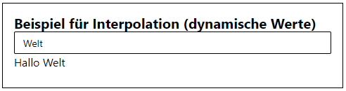
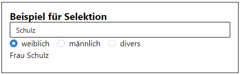
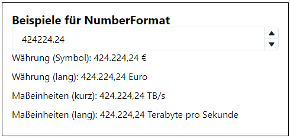
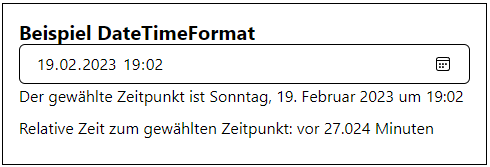

# How to translate an app

To show how we can use I18n in our pioneer apps, we will extend the empty app (at `src/apps/empty`).

By default, the empty app is prepared to support I18n with locale `en`.
We will add support for another language (locale `de`) and demonstrate advanced features of [FormatJS](https://formatjs.io/) Intl.

> **Note**  
> For more details to I18n file format please check [I18nFormat](../reference/I18nFormat.md).

## Preparing i18n support for our app

To begin, start the development server

```bash
pnpm run dev
```

and open the [empty app](http://localhost:5173/sites/empty/)

Open the `build.config.mjs` and add locale `de` to the `i18n` property:

```js
// src/apps/empty/build.config.mjs
import { defineBuildConfig } from "@open-pioneer/build-support";

export default defineBuildConfig({
    i18n: ["de", "en"]
});
```

We will see an error message in browser, because of the missing yaml file for our new locale.
We need to create the file in the `i18n` folder. The naming schema of the file is `{locale}.yaml`.

```yaml
# src/apps/empty/i18n/de.yaml
messages:
    heading: I18n HowTo
    text: Wie lässt sich I18n in Pioneer Apps nutzen?
```

By default, the app uses the browser settings or system default for determining the locale.
If your browser locale is set to `de` you should see the values from `de.yaml`.


To demonstrate the multi-language support and force a language of our choice, we need to modify the `app.ts`:

```javascript
// src/apps/empty/app.ts
import { createCustomElement } from "@open-pioneer/runtime";
import * as appMetadata from "open-pioneer:app";
import { AppUI } from "./AppUI";

const Element = createCustomElement({
    component: AppUI,
    appMetadata,
    async resolveConfig(ctx) {
        const locale = ctx.getAttribute("forced-locale");
        if (!locale) {
            return undefined;
        }
        return { locale };
    }
});
customElements.define("i18n-howto", Element);
```

and the `index.html`:

```html
<!DOCTYPE html>
<!-- src/sites/empty/index.html -->
<html lang="en">
    <head>
        <meta charset="UTF-8" />
        <meta name="viewport" content="width=device-width, initial-scale=1.0" />
        <title>Empty Site</title>
    </head>
    <body>
        <div id="container"></div>
        <script type="module">
            import "./empty/app.ts";

            const container = document.getElementById("container");
            initApp();
            function initApp() {
                const queryString = window.location.search;
                const urlParams = new URLSearchParams(queryString);
                const lang = urlParams.get("lang");
                const app = document.createElement("i18n-howto");
                if (lang) {
                    app.setAttribute("forced-locale", lang);
                }
                container.appendChild(app);
            }
        </script>
    </body>
</html>
```

Now we are able to force the locale with `lang` parameter:
[http://localhost:5173/sites/empty/?lang=de](http://localhost:5173/sites/empty/?lang=de) or [http://localhost:5173/sites/empty/?lang=en](http://localhost:5173/sites/empty/?lang=en)

> **Note**  
> The integration of I18n works the same way for pioneer packages. We have to add the `i18n` configuration in `build.config.mjs` and matching yaml files for each language in the `i18n` folder. For each app/language combination, the build tool collects the YAML files of the app and the used packages and merges them into a flattened JSON structure.  
> As mentioned in [I18nFormat](../reference/I18nFormat.md) we can override yaml entries from packages in our app yaml. Please check the `i18n-sample` app as a practical example for this topic.

## Using advanced features of FormatJS Intl

In a first step we prepare our AppUI:

```javascript
// src/apps/empty/AppUI.tsx
export function AppUI() {
    const intl = useIntl();
    return (
        <Container>
            <Heading as="h1" size="lg">
                {intl.formatMessage({ id: "heading" })}
            </Heading>
            <Text>{intl.formatMessage({ id: "text" })}</Text>
            <ExampleStack></ExampleStack>
        </Container>
    );
}
```

We initialize the `intl` object with the `useIntl` hook. Now we can use `intl.formatMessage` with our flattened keys from the yaml files to add our translated text to the app.
In addition, we define the `ExampleStack` as a container for our advanced examples.

### Interpolation

First we generate an entry in our `ExampleStack` for our `InterpolationExample`:

```javascript
// src/apps/empty/AppUI.tsx
function ExampleStack() {
    return (
        <Stack
            mb={5}
            mt={5}
            divider={<StackDivider borderColor="gray.200" />}
            spacing="24px"
            align="stretch"
        >
            <Box bg="white" w="100%" p={4} color="black" borderWidth="1px" borderColor="black">
                <InterpolationExample></InterpolationExample>
            </Box>
        </Stack>
    );
}
```

Interpolation allows replacement with dynamic values. That's why we use a text input field in our interpolation example:

```javascript
// src/apps/empty/AppUI.tsx
function InterpolationExample() {
    const intl = useIntl();
    const [value, setValue] = useState("");
    return (
        <>
            <Heading as="h4" size="md">
                {intl.formatMessage({ id: "interpolation.heading" })}
            </Heading>
            <Input
                value={value}
                onChange={(evt) => setValue(evt.target.value)}
                placeholder={intl.formatMessage({ id: "interpolation.placeholder" })}
                size="sm"
            />
            <Text mb="8px">
                {intl.formatMessage({ id: "interpolation.value" }, { name: value })}
            </Text>
        </>
    );
}
```

As we can see, the bound input value `value` is passed to the `intl.formatMessage` function with the parameter name `name`.
Add the keys and values to the yaml configuration:

```yaml
# src/apps/empty/i18n/de.yaml
messages:
    #....
    interpolation:
        heading: Beispiel für Interpolation (dynamische Werte)
        value: Hallo {name}
        placeholder: Geben Sie Ihren Namen ein...
#....
```

Add the defined keys to all yaml files.

The `interpolation.value` key uses a placeholder for `name`.
In the rendered text the passed value of `name` will replace the placeholder.



### Plurals

We generate another entry in our `ExampleStack` for our `PluralsExample`:

```javascript
// src/apps/empty/AppUI.tsx
function ExampleStack() {
    return (
        <Stack
            mb={5}
            mt={5}
            divider={<StackDivider borderColor="gray.200" />}
            spacing="24px"
            align="stretch"
        >
            <Box bg="white" w="100%" p={4} color="black" borderWidth="1px" borderColor="black">
                <InterpolationExample></InterpolationExample>
            </Box>
            <Box bg="white" w="100%" p={4} color="black" borderWidth="1px" borderColor="black">
                <PluralsExample></PluralsExample>
            </Box>
        </Stack>
    );
}
```

With plural support we can output different text depending on a count value (see [Link](https://formatjs.io/docs/core-concepts/icu-syntax/#plural-format)).
We will use a RadioGroup to change the count value in our example:

```javascript
// src/apps/empty/AppUI.tsx
function PluralsExample() {
    const intl = useIntl();
    const [value, setValue] = useState("1");
    return (
        <>
            <Heading as="h4" size="md">
                {intl.formatMessage({ id: "plurals.heading" })}
            </Heading>
            <RadioGroup onChange={setValue} value={value}>
                <Stack spacing={4} direction="row">
                    <Radio size="md" value="0">
                        0
                    </Radio>
                    <Radio size="md" value="1">
                        1
                    </Radio>
                    <Radio size="md" value="42">
                        42
                    </Radio>
                    <Radio size="md" value="99">
                        99
                    </Radio>
                </Stack>
            </RadioGroup>
            <Text mb="8px">{intl.formatMessage({ id: "plurals.value" }, { n: value })}</Text>
        </>
    );
}
```

The bound value `value` is passed to the `intl.formatMessage` function with the parameter name `n`. Here is the yaml configuration:

```yaml
# src/apps/empty/i18n/de.yaml
messages:
    #....
    plurals:
        heading: Beispiel für Plural
        value: "Wir trinken {n, plural, =0 {kein Bier} one {ein Bier} other {# Biere} =99 {zu viel Bier}}"
#....
```

Add the defined keys to all yaml files.

The `plurals.value` key defines a count parameter `n`. In result the passed value of `n` will be used to generate the matching output.


### Selection

Let's add an entry for `SelectionExample` in our `ExampleStack`:

```javascript
// src/apps/empty/AppUI.tsx
function ExampleStack() {
    return (
        <Stack
            mb={5}
            mt={5}
            divider={<StackDivider borderColor="gray.200" />}
            spacing="24px"
            align="stretch"
        >
            <Box bg="white" w="100%" p={4} color="black" borderWidth="1px" borderColor="black">
                <InterpolationExample></InterpolationExample>
            </Box>
            <Box bg="white" w="100%" p={4} color="black" borderWidth="1px" borderColor="black">
                <PluralsExample></PluralsExample>
            </Box>
            <Box bg="white" w="100%" p={4} color="black" borderWidth="1px" borderColor="black">
                <SelectionExample></SelectionExample>
            </Box>
        </Stack>
    );
}
```

With selection support we can output different text depending on a set of given values (see [Link](https://formatjs.io/docs/core-concepts/icu-syntax/#select-format)).
In our example we will change the title depending on a gender selection.
We will use a text input for name and a RadioGroup for gender selection:

```javascript
// src/apps/empty/AppUI.tsx
function SelectionExample() {
    const intl = useIntl();
    const [value1, setValue1] = useState("");
    const [value2, setValue2] = useState("male");
    return (
        <>
            <Heading as="h4" size="md">
                {intl.formatMessage({ id: "selection.heading" })}
            </Heading>
            <Input
                value={value1}
                onChange={(evt) => setValue1(evt.target.value)}
                placeholder={intl.formatMessage({ id: "interpolation.placeholder" })}
                size="sm"
            />
            <RadioGroup onChange={setValue2} value={value2}>
                <Stack spacing={4} direction="row">
                    <Radio size="md" value="female">
                        {intl.formatMessage({ id: "selection.gender.female" })}
                    </Radio>
                    <Radio size="md" value="male">
                        {intl.formatMessage({ id: "selection.gender.male" })}
                    </Radio>
                    <Radio size="md" value="other">
                        {intl.formatMessage({ id: "selection.gender.other" })}
                    </Radio>
                </Stack>
            </RadioGroup>
            <Text mb="8px">
                {intl.formatMessage({ id: "selection.value" }, { name: value1, gender: value2 })}
            </Text>
        </>
    );
}
```

We pass the name (`value1`) and gender (`value2`) to the `intl.formatMessage`.
Here is the yaml configuration:

```yaml
# src/apps/empty/i18n/de.yaml
messages:
    #....
    selection:
        heading: Beispiel für Selektion
        value: "{gender, select, male {Herr} female {Frau} other {}} {name}"
        gender:
            male: männlich
            female: weiblich
            other: divers
#....
```

Add the defined keys to all `yaml` files.

The `selection.value` key defines a parameter `gender` for selection and uses the dynamic parameter `name`.
In a selection we always have to define the `other` parameter.
It is used if the given parameter value does not match one of the other values (e.g. `male` or `female`).
In result the passed value of `gender` and `name` will be used to generate the matching output.



### Number Format

Now we add an entry for `NumberFormatExample` to our `ExampleStack` :

```javascript
// src/apps/empty/AppUI.tsx
function ExampleStack() {
    return (
        <Stack
            mb={5}
            mt={5}
            divider={<StackDivider borderColor="gray.200" />}
            spacing="24px"
            align="stretch"
        >
            <Box bg="white" w="100%" p={4} color="black" borderWidth="1px" borderColor="black">
                <InterpolationExample></InterpolationExample>
            </Box>
            <Box bg="white" w="100%" p={4} color="black" borderWidth="1px" borderColor="black">
                <PluralsExample></PluralsExample>
            </Box>
            <Box bg="white" w="100%" p={4} color="black" borderWidth="1px" borderColor="black">
                <SelectionExample></SelectionExample>
            </Box>
            <Box bg="white" w="100%" p={4} color="black" borderWidth="1px" borderColor="black">
                <NumberFormatExample></NumberFormatExample>
            </Box>
        </Stack>
    );
}
```

With `formatNumber` we can not only format numbers locale specific, but also use units and currencies (see [Link](https://formatjs.io/docs/react-intl/api#formatnumber)).
In our example we will have a number input and an output with different forms of unit and currency:

```javascript
// src/apps/empty/AppUI.tsx
function NumberFormatExample() {
    const intl = useIntl();
    const [value, setValue] = useState("424224.24");
    return (
        <>
            <Heading as="h4" size="md">
                {intl.formatMessage({ id: "numberformat.heading" })}
            </Heading>
            <NumberInput
                onChange={(valueString) => setValue(valueString)}
                value={value}
                precision={2}
                step={0.25}
            >
                <NumberInputField />
                <NumberInputStepper>
                    <NumberIncrementStepper />
                    <NumberDecrementStepper />
                </NumberInputStepper>
            </NumberInput>
            <Text mb="8px">
                {intl.formatMessage({ id: "numberformat.example.currency1" })}
                {intl.formatNumber(+value, { style: "currency", currency: "EUR" })}
            </Text>
            <Text mb="8px">
                {intl.formatMessage({ id: "numberformat.example.currency2" })}
                {intl.formatNumber(+value, {
                    style: "currency",
                    currency: "EUR",
                    currencyDisplay: "name"
                })}
            </Text>
            <Text mb="8px">
                {intl.formatMessage({ id: "numberformat.example.unit1" })}
                {intl.formatNumber(+value, { style: "unit", unit: "terabyte-per-second" })}
            </Text>
            <Text mb="8px">
                {intl.formatMessage({ id: "numberformat.example.unit2" })}
                {intl.formatNumber(+value, {
                    style: "unit",
                    unit: "terabyte-per-second",
                    unitDisplay: "long"
                })}
            </Text>
        </>
    );
}
```

Here is the yaml configuration:

```yaml
# src/apps/empty/i18n/de.yaml
messages:
    #....
    numberformat:
        heading: Beispiele für NumberFormat
        example:
            currency1: "Währung (Symbol): "
            currency2: "Währung (lang): "
            unit1: "Maßeinheiten (kurz): "
            unit2: "Maßeinheiten (lang): "
#....
```

Add the defined keys to all yaml files.

We pass the `value` with different `NumberFormatOptions` to `intl.formatNumber`. In result, we see our formatted numbers.



### Date/Time Format and Relative Time Format

Finally, we add an entry for the `DateTimeFormatExample` to our `ExampleStack` :

```javascript
// src/apps/empty/AppUI.tsx
function ExampleStack() {
    return (
        <Stack
            mb={5}
            mt={5}
            divider={<StackDivider borderColor="gray.200" />}
            spacing="24px"
            align="stretch"
        >
            <Box bg="white" w="100%" p={4} color="black" borderWidth="1px" borderColor="black">
                <InterpolationExample></InterpolationExample>
            </Box>
            <Box bg="white" w="100%" p={4} color="black" borderWidth="1px" borderColor="black">
                <PluralsExample></PluralsExample>
            </Box>
            <Box bg="white" w="100%" p={4} color="black" borderWidth="1px" borderColor="black">
                <SelectionExample></SelectionExample>
            </Box>
            <Box bg="white" w="100%" p={4} color="black" borderWidth="1px" borderColor="black">
                <NumberFormatExample></NumberFormatExample>
            </Box>
            <Box bg="white" w="100%" p={4} color="black" borderWidth="1px" borderColor="black">
                <DateTimeFormatExample></DateTimeFormatExample>
            </Box>
        </Stack>
    );
}
```

In our example we will have a date time input:

```javascript
// src/apps/empty/AppUI.tsx
function DateTimeFormatExample() {
    const intl = useIntl();
    const [value, setValue] = useState("2023-02-19T19:02");
    return (
        <>
            <Heading as="h4" size="md">
                {intl.formatMessage({ id: "datetimeformat.heading" })}
            </Heading>
            <Input
                value={value}
                onChange={(evt) => setValue(evt.target.value)}
                size="md"
                type="datetime-local"
            />
            <Text mb="8px">
                {intl.formatMessage({ id: "datetimeformat.timelabel" })}
                {intl.formatDate(value, { dateStyle: "full", timeStyle: "short" })}
            </Text>
            <Text mb="8px">
                {intl.formatMessage({ id: "datetimeformat.relativetimelabel" })}
                {intl.formatRelativeTime(getDeltaTime(value), "minute", {
                    numeric: "auto",
                    style: "long"
                })}
            </Text>
        </>
    );
}
```

To calculate the delta for our relative time output we define the function `getDeltaTime`:

```javascript
function getDeltaTime(datetime: string): number {
    const delta = new Date(datetime).getTime() - new Date().getTime();
    return Math.round(delta / 60000);
}
```

Here is the yaml configuration:

```yaml
# src/apps/empty/i18n/de.yaml
messages:
    #....
    datetimeformat:
        heading: Beispiel DateTimeFormat
        timelabel: "Der gewählte Zeitpunkt ist "
        relativetimelabel: "Relative Zeit zum gewählten Zeitpunkt: "
#....
```

Add the defined keys to all yaml files.

We pass the `value` with `DateTimeFormatOptions` to `intl.formatDate` (see [Link](https://formatjs.io/docs/react-intl/api#formatdate))
and with `RelativeTimeFormatOptions` to `intl.formatRelativeTime` (see [Link](https://formatjs.io/docs/react-intl/api#formatrelativetime))

In result, we see our selected formatted datetime and the relative time between now and the selected datetime.



> **Note**  
> The used datetime input does not support a forced locale.
> It always uses the defined browser locale or the system default. In our example, if your browser uses locale `de`
> but your app uses url parameter `lang=en` the input will show values matching to locale `de`.

## Demo App

The complete app `i18n-howto` can be found in the `samples` folder.

## Further reading

-   [FormatJS Documentation](https://formatjs.io/docs/getting-started/installation)
-   [Message syntax](https://formatjs.io/docs/core-concepts/icu-syntax)
-   [Intl Reference](https://formatjs.io/docs/react-intl/api#intlshape) (interface `IntlFormatters`)
