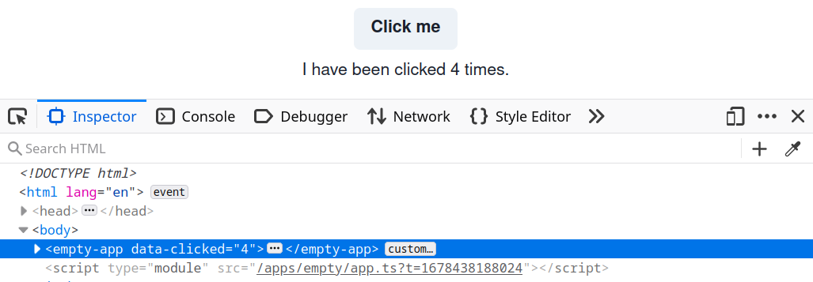

# How to use a service

Services are one of the central mechanisms of code sharing in an open pioneer client application.
Instead of using global variables (or singletons), services are started per-application instance.

Builtin dependency injection support allows services to declare their dependencies on other services.
The framework automatically starts all required services in their correct order and injects references where needed.

Services can be used from other services or from UI components.

## Using a service from a React component

In this section, we will customize the `empty` app's UI (in `src/apps/empty`).
At the time of this writing, the framework does not contain a lot of builtin services we could use for our example, so the following use case is somewhat constructed.

Consider an app embedded as a custom element into some site.
It can be useful to change the element's attributes from inside the application, for example to allow the surrounding site to apply different styles to the element (e.g. by using [attribute selectors](https://developer.mozilla.org/en-US/docs/Web/CSS/Attribute_selectors)).

Our objective in this section is to add a custom attribute to the component by pressing a button in our app's UI.
By default, services or UI components inside the app do not get a reference to the app's custom element.
However, the builtin service providing `"runtime.ApplicationContext"` can be used to achieve that goal.

Thus, we edit our app's `build.config.mjs` to state that the UI requires a reference of the service:

```js
// src/apps/empty/build.config.mjs
import { defineBuildConfig } from "@open-pioneer/build-support";

export default defineBuildConfig({
    ui: {
        references: ["runtime.ApplicationContext"]
    }
});
```

The package providing the implementation of a service must be declared as a dependency in the `package.json`.
Luckily, the empty app already depends on the `@open-pioneer/runtime` package, so we don't have to do anything in this case.

React components can use [hooks](https://reactjs.org/docs/hooks-intro.html) to interact with the pioneer framework.
One of which is the `useService` hook, we will use below.
We extend the UI of the empty app to add our custom class:

```tsx
// src/apps/empty/AppUI.tsx
import { Button, Container, Text, VStack } from "@open-pioneer/chakra-integration";
import { useService } from "open-pioneer:react-hooks";
import { useState } from "react";

export function AppUI() {
    // (1)
    const appCtx = useService("runtime.ApplicationContext");

    // (2)
    const [clickCount, setClickCount] = useState(0);
    const onButtonClicked = () => {
        const newCount = clickCount + 1;
        setClickCount(newCount);

        // (3)
        const host = appCtx.getHostElement();
        host.setAttribute("data-clicked", String(newCount));
    };

    return (
        <Container>
            <VStack>
                <Button onClick={onButtonClicked}>Click me</Button>
                <Text>I have been clicked {clickCount} times.</Text>
            </VStack>
        </Container>
    );
}
```

-   **(1)**
    Fetches a reference to the service using the `useService` hook from `"open-pioneer:react-hooks"`.
-   **(2)**
    React's [`useState`](https://reactjs.org/docs/hooks-state.html) is used to manage the component's click count.
-   **(3)**
    Applies the new click count to the application's host element.

The custom attribute will now be present when you inspect your app after pressing the button:



## Using a service from another service

For this example, we will build upon the example from previous section.
We will move the logic of updating the element's attribute into a service.
The new service will reference `"runtime.ApplicationContext"`, and the UI will be changed to reference our new service instead.

To define our new service - which we will call `AttributeService` - we create a `service.ts` file in our application package.
When searching for the implementation of a service, the framework will try to import it from a file called `<PACKAGE_NAME>/services.ts` (or `.js`) by default.
If the file does not exist, or if it does not contain a matching `export`, an error will be generated.
Thus, make sure to add an export in there.

We will create the class for our service:

```ts
// src/apps/empty-app/services.ts
export class AttributeService {
    // TODO
}
```

To register the service with the framework, we must edit the `build.config.mjs`:

```js
// src/apps/empty-app/build.config.mjs
import { defineBuildConfig } from "@open-pioneer/build-support";

export default defineBuildConfig({
    services: {
        // (1)
        AttributeService: {
            // (2)
            provides: "empty.AttributeService",
            // (3)
            references: {
                ctx: "runtime.ApplicationContext"
            }
        }
    },
    ui: {
        references: ["runtime.ApplicationContext"]
    }
});
```

-   **(1)**  
    Declares the new service. The name here (left to the `":"`) must match the `export` from the `services.ts`.

-   **(2)**  
    Declares the interfaces provided by the new service.
    Interface names can be chosen arbitrarily, but they should not collide.
    It is a good practice to choose a prefix similar (or equal) to the package name.

-   **(3)**  
    References the interface `"runtime.ApplicationContext"`.
    The service object will be injected by the framework into the class' constructor as `ctx` (the name can be freely chosen).

Next, we will fill in the implementation of `AttributeService`:

```ts
// src/apps/empty-app/services.ts
import { ServiceOptions, ServiceType } from "@open-pioneer/runtime";

interface References {
    ctx: ServiceType<"runtime.ApplicationContext">;
}

const CLASS_NAME = "my-custom-class";

export class CssClassService {
    private _ctx: ServiceType<"runtime.ApplicationContext">;

    // (1)
    constructor(options: ServiceOptions<References>) {
        // (2)
        this._ctx = options.references.ctx;
    }

    // (3)
    addClass() {
        this._ctx.getApplicationContainer().classList.add(CLASS_NAME);
    }

    removeClass() {
        this._ctx.getApplicationContainer().classList.remove(CLASS_NAME);
    }
}
```

-   **(1)**  
    The framework uses the `options` parameter to inject all service options, including the `references`.

    We use a `References` interface to declare which types (and names) to expect.
    This should match the configuration in your `build.config.mjs`.
    Inside the `References` interface, you can either use the type `ApplicationContext` directly (from the runtime package) or use the `ServiceType<...>` helper, which retrieves the interface type when given an interface name.

    > If you want to register your own interface names and types, see _TypeScript Integration_ in the [Services Reference](../reference/Services.md).

    Note that this is only needed if you're using TypeScript. When you're using JavaScript, just use the `options` parameter directly.

-   **(2)**  
    This stores the injected service instance into a property of our own service instance.
    The name `ctx` is the same as the name of the reference in the `build.config.mjs`.

-   **(3)**
    The implementation of `updateAttribute()` was moved from the React component.

Finally, we will update our UI to use our new service.
In the `build.config.mjs`, the UI now requires the interface `"empty.AttributeService"`:

```js
// src/apps/empty-app/build.config.mjs
import { defineBuildConfig } from "@open-pioneer/build-support";

export default defineBuildConfig({
    // ... services ...
    ui: {
        references: ["empty.AttributeService"]
    }
});
```

And our UI will now call the methods of our `AttributeService`:

```tsx
import { Button, Container, Text, VStack } from "@open-pioneer/chakra-integration";
import { useService } from "open-pioneer:react-hooks";
import { useState } from "react";
import { type AttributeService } from "./services";

export function AppUI() {
    // (1)
    const attributeService = useService("empty.AttributeService") as AttributeService;

    // (2)
    const [clickCount, setClickCount] = useState(0);
    const onButtonClicked = () => {
        const newCount = clickCount + 1;
        setClickCount(newCount);
        attributeService.updateAttribute(newCount);
    };

    return (
        <Container>
            <VStack>
                <Button onClick={onButtonClicked}>Click me</Button>
                <Text>I have been clicked {clickCount} times.</Text>
            </VStack>
        </Container>
    );
}
```

-   **(1)**  
    We updated the interface name.

    The return value from `useService` has to be casted manually to the expected type in this case, otherwise we would receive `unknown`.
    This is because we have not registered the interface type with the framework (which can be okay for internal services and simple examples).
    The document [How to create a service](./HowToCreateAService.md) goes into more detail.

    Note that this is only needed if you're using TypeScript.

-   **(2)**  
    The body of the click handler now calls our service.

After following these steps, your application's external behavior will be unchanged: the attribute will still be updated.

## Further reading

-   [How to create a service](./HowToCreateAService.md)
-   [Package reference](../reference/Package.md)
-   [Services Reference](../reference/Services.md)
