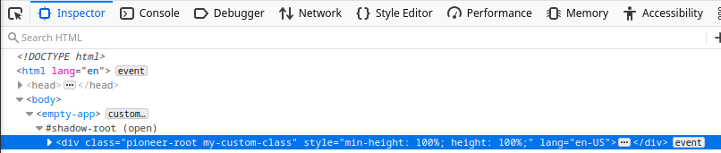

# How to use a service

Services are one of the central mechanisms of code sharing in an open pioneer client application.
Instead of using global variables (or singletons), services are started per-application instance.

Builtin dependency injection support allows services to declare their dependencies.
The framework automatically starts all required services in their correct order and injects references where needed.

Services can be used from other services or from UI components.

## Using a service from a React component

In this section, we will customize the `empty` app's UI (in `src/apps/empty`).
Our objective is to add a custom CSS class to the application's root `div` from our React UI.

To obtain a reference to the root `div`, we need the service implementing `"runtime.ApplicationContext"`.
Thus, we edit our app's `build.config.mjs`:

```js
// src/apps/empty/build.config.mjs
import { defineBuildConfig } from "@open-pioneer/build-support";

export default defineBuildConfig({
    ui: {
        references: ["runtime.ApplicationContext"]
    }
});
```

The package providing the implementation of a service must be declared as a dependency in the `package.json`.
Luckily, the empty app already depends on the `@open-pioneer/runtime` package so we don't have to do anything in this case.

React components can use [hooks](https://reactjs.org/docs/hooks-intro.html) to interact with the pioneer framework, one of which is the `useService` hook used below.
We extend the UI of the empty app to add our custom class:

```tsx
// src/apps/empty/AppUI.tsx
import { Container, Heading, Text } from "@open-pioneer/chakra-integration";
import { useService } from "open-pioneer:react-hooks";
import { useEffect } from "react";

const CLASS_NAME = "my-custom-class";

export function AppUI() {
    // (1)
    const appCtx = useService("runtime.ApplicationContext");

    // (2)
    useEffect(() => {
        const div = appCtx.getApplicationContainer();
        div.classList.add(CLASS_NAME);

        // (3)
        return () => div.classList.remove(CLASS_NAME);
    }, [appCtx]);

    return (
        <Container>
            <Heading as="h1" size="lg">
                Empty App
            </Heading>
            <Text>This is an empty app.</Text>
        </Container>
    );
}
```

-   **(1)**
    Fetches a reference to the service.
-   **(2)**
    Uses the [`useEffect`](https://reactjs.org/docs/hooks-effect.html) hook to perform a side effect when the component is mounted.
    We add a single class to the application's container-`div`.

    > **Note**  
    > This is just an example to demonstrate a side effect. Adding a class to the container `div` is usually not needed.

-   **(3)**
    We return a cleanup function: this will be called by react to revert the side effect in the `useEffect` hook. Forgetting to return cleanup function is a frequent error when executing side effects.

The custom class will now be present when you inspect your app:



## Using a service from another service

For this example, we will move the logic of adding and removing the class into a service.
The new service will reference `"runtime.ApplicationContext"`, and the UI will be changed to reference our new service instead.

To define our new service - which we will call `CssClassService` - we create a `service.ts` file in our application package.
When searching for the implementation of a service, the framework will try to import it from a file called `<PACKAGE_NAME>/services.ts` (or `.js`) by default.
If the file does not exist, or if it does not contain a matching `export`, an error will be generated.

```ts
// src/apps/empty-app/services.ts
export class CssClassService {
    // TODO
}
```

To register the service with the framework, we must edit the `build.config.mjs`:

```js
// src/apps/empty-app/build.config.mjs
import { defineBuildConfig } from "@open-pioneer/build-support";

export default defineBuildConfig({
    services: {
        // (1)
        CssClassService: {
            // (2)
            provides: "empty.CssClassService",
            // (3)
            references: {
                ctx: "runtime.ApplicationContext"
            }
        }
    },
    ui: {
        references: ["runtime.ApplicationContext"]
    }
});
```

-   **(1)**  
    Declares the new service. The name here (left to the `":"`) must match the `export` from the `services.ts`.

-   **(2)**  
    Declares the interfaces provided by the new service.
    Interfaces names can be chosen arbitrarily, but they should not collide.
    It is a good practice to chose a prefix similar (or equal) to the package name.

-   **(3)**  
    References the interface `"runtime.ApplicationContext"`.
    The service object will be injected by the framework into the class' constructor as `ctx` (the name can be freely chosen).

Next, we will fill in the implementation of `CssClassService`:

```ts
// src/apps/empty-app/services.ts
import { ServiceOptions, ServiceType } from "@open-pioneer/runtime";

interface References {
    ctx: ServiceType<"runtime.ApplicationContext">;
}

const CLASS_NAME = "my-custom-class";

export class CssClassService {
    private _ctx: ServiceType<"runtime.ApplicationContext">;

    // (1)
    constructor(options: ServiceOptions<References>) {
        // (2)
        this._ctx = options.references.ctx;
    }

    // (3)
    addClass() {
        this._ctx.getApplicationContainer().classList.add(CLASS_NAME);
    }

    removeClass() {
        this._ctx.getApplicationContainer().classList.remove(CLASS_NAME);
    }
}
```

-   **(1)**  
    The framework uses the `options` parameter to inject all service options, including the `references`.

    We use a `References` interface to declare which types (and names) to expect.
    This should match the configuration in your `build.config.mjs`.
    Inside the `References` interface, you can either use the type `ApplicationContext` directly (from the runtime package) or use the `ServiceType<...>` helper, which retrieves the interface type when given an interface name.

    > If you want to register your own interface names and types, see _TypeScript Integration_ in the [Services Reference](../reference/Services.md).

    Note that this is only needed if you're using TypeScript. When you're using JavaScript, just use the `options` parameter directly.

-   **(2)**  
    This stores the injected service instance into a property of our own service instance.
    The name `ctx` is the same as the name of the reference in the `build.config.mjs`.

-   **(3)**
    The implementation of `addClass()` and `removeClass()` was moved from the React component.

Finally, we will update our UI to use our new service.
In the `build.config.mjs`, the UI now requires the interface `"empty.CssClassService"`:

```js
// src/apps/empty-app/build.config.mjs
import { defineBuildConfig } from "@open-pioneer/build-support";

export default defineBuildConfig({
    // ... services ...
    ui: {
        references: ["empty.CssClassService"]
    }
});
```

And our UI will now call the methods of our `CssClassService`:

```ts
import { Container, Heading, Text } from "@open-pioneer/chakra-integration";
import { useService } from "open-pioneer:react-hooks";
import { useEffect } from "react";
import { type CssClassService } from "./services";

export function AppUI() {
    // (1)
    const classService = useService("empty.CssClassService") as CssClassService;

    // (2)
    useEffect(() => {
        classService.addClass();
        return () => classService.removeClass();
    }, [classService]);

    return (
        <Container>
            <Heading as="h1" size="lg">
                Empty App
            </Heading>
            <Text>This is an empty app.</Text>
        </Container>
    );
}
```

-   **(1)**  
    We updated the interface name.

    The return value from `useService` has to be casted manually to the expected type in this case, otherwise we would receive `unknown`.
    This is because we have not registered the interface type with the framework (which can be okay for internal services and simple examples).
    The document [How to create a service](./HowToCreateAService.md) goes into more detail.

-   **(2)**  
    The body of the `useEffect` hook now calls our service.

After following these steps, your application's container node will still have its custom class.

## Further reading

-   [How to create a service](./HowToCreateAService.md)
-   [Package reference](../reference/Package.md)
-   [Services Reference](../reference/Services.md)
