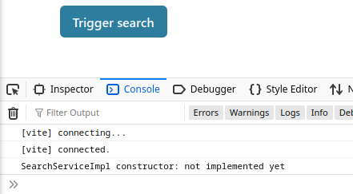

# How to use properties

Properties are configurable values associated with a [Package](../reference/Package.md).
Packages can use their [build.config.mjs](../reference/Package.md#properties) to define which properties they support and assign some optional default values.
Properties are often documented as part of a package's public API.

An app that uses a package can assign custom values to those properties, which may alter the behavior of the package at runtime.

It is best to think of package properties as _global_ configuration: given a property `prop` of a package `pkg`, all services and UI components implemented in that package will receive the _same_ value of `prop` when the application runs.
They are therefore not suited for fine-grained customization, for example to provide different values for each function call or UI component.
Use JavaScript function parameters or React props for those use cases instead.

## Using properties in a package

We will implement a simple `search-service` package that "searches" for results using a backend service.
The URL to that backend service shall be configurable as a property.
We're going to develop the property configuration, but we will skip the actual searching part of the implementation.

### Setup

First of all, create the `search-service` package:

```jsonc
// src/packages/search-service/package.json
{
    "name": "search-service",
    "private": true,
    "dependencies": {
        "@open-pioneer/runtime": "<omitted, use a recent version>"
    }
}
```

```js
// src/packages/search-service/build.config.mjs
import { defineBuildConfig } from "@open-pioneer/build-support";

export default defineBuildConfig({
    services: {
        SearchService: {
            provides: "search-service.SearchService"
        }
    }
});
```

Execute `pnpm install` to set up the package's dependencies.

The search service starts off as an empty class:

```ts
// src/packages/search-service/SearchService.ts
export class SearchService {
    constructor() {
        console.debug("SearchService constructor: not implemented yet");
    }
}
```

Then, export the service from the package's `services.ts` entry point:

```ts
// src/packages/search-service/services.ts
export { SearchService } from "./SearchService";
```

Finally, we will also "use" the new service in our app:

```jsonc
// src/apps/empty
{
    // ...
    "dependencies": {
        // Add the dependency
        "search-service": "workspace:^"
    }
}
```

```js
// src/apps/empty/build.config.mjs
import { defineBuildConfig } from "@open-pioneer/build-support";

export default defineBuildConfig({
    // ...
    ui: {
        references: ["search-service.SearchService"]
    }
});
```

Execute `pnpm install` again so the application can find the package.

The user interface our of application access the service, but doesn't do anything with it yet:

```tsx
import { Button, Container } from "@open-pioneer/chakra-integration";
import { useService } from "open-pioneer:react-hooks";

export function AppUI() {
    // TypeScript integration skipped in this tutorial, see "How to create a service" tutorial.
    // eslint-disable-next-line @typescript-eslint/no-explicit-any
    const searchService = useService<any>("search-service.SearchService");
    return (
        <Container>
            <Button
                onClick={() => {
                    // Nothing yet
                }}
            >
                Trigger search
            </Button>
        </Container>
    );
}
```

The app should start and the service's constructor should run:



### Defining the property

We define the property `backendUrl` in the package `search-service` to control which backend service gets used by the service.
For this example, we also define a default value:

```js
// src/packages/search-service/build.config.mjs
import { defineBuildConfig } from "@open-pioneer/build-support";

export default defineBuildConfig({
    // ...
    properties: {
        // Defines the property 'backendUrl' with the given default value.
        // Use `null` if you don't want to define a default value (`propertiesMeta` can be used
        // make those properties required).
        backendUrl: "http://search-backend.example.com"
    }
});
```

Next, we will update the implementation of `SearchService` to read the property's value.
Just like service references, properties are passed to the service constructor by the framework:

```ts
// src/packages/search-service/SearchService.ts
import { ServiceOptions } from "@open-pioneer/runtime";

export class SearchService {
    private _backendUrl: string;

    // (1)
    constructor(serviceOptions: ServiceOptions) {
        this._backendUrl = serviceOptions.properties.backendUrl as string; // (2)
    }

    search() {
        console.log(`Searching using ${this._backendUrl} ...`); // (3)
    }
}
```

-   **(1)**
    The `serviceOptions` parameter is provided by the framework.
-   **(2)**
    `serviceOptions.properties.backendUrl` contains the value of the property.
-   **(3)**
    Triggers a "search" and prints the current value of the backend url, for inspection.

We will quickly update the application's UI to try the new method:

```diff
import { Button, Container } from "@open-pioneer/chakra-integration";
import { useService } from "open-pioneer:react-hooks";

export function AppUI() {
    // eslint-disable-next-line @typescript-eslint/no-explicit-any
    const searchService = useService<any>("search-service.SearchService");
    return (
        <Container>
            <Button
                onClick={() => {
-                   // Nothing yet
+                   searchService.search();
                }}
            >
                Trigger search
            </Button>
        </Container>
    );
}
```

Clicking on the button unsurprisingly prints:


> NOTE: You can also read package properties in UI components using the `useProperties` hook.
> The values returned from that hook will be the same as in `serviceOptions.properties`.

## Setting properties in an app

Let's imagine that the `search-service` package is used across many apps with different deployment environments.
For one of those apps, we want to use a different `backendUrl` without altering the package's source code.

To do so, simply update your `app.ts` to override the property:

```ts
// src/apps/empty/app.ts
// ...
const Element = createCustomElement({
    component: AppUI,
    appMetadata,
    config: {
        // (1)
        properties: {
            // (2)
            "search-service": {
                backendUrl: "http://custom-search-backend.example.com"
            }
        }
    }
});
```

-   **(1)**
    The `properties` object can define (or override) properties for every package in the application.
-   **(2)**
    Property values for the `search-service` package.
    The key must be the exact name of the package.
    The properties defined here should be supported by the package.

That's it. After reloading the application, pressing the button now prints:


## Providing TypeScript support

Writing raw JSON objects as in **(2)** above can be error-prone.

Consider exporting a TypeScript interface that matches the properties defined by your package:

```ts
// Somewhere in the `search-service` package
export interface SearchServiceProperties {
    // Documentation...
    backendUrl?: string;
}
```

Then you can use that interface in your `app.ts` to guard against typos and to provide suggestions:

```ts
// src/apps/empty/app.ts
import { SearchServiceProperties } from "...";

const Element = createCustomElement({
    component: AppUI,
    appMetadata,
    config: {
        properties: {
            "search-service": {
                backendUrl: "http://custom-search-backend.example.com"
            } satisfies SearchServiceProperties
        }
    }
});
```

## Dynamic property values

The shown way to define properties in your `app.ts` defines a _fixed_ value for all instances of your application.
This is fine if you only have a single instance, and if that instance's configuration does not depend on any dynamic state.

For example, if your application is used twice in the same `.html` file, both instances would use the same `backendUrl`:

```html
<!-- ... -->
<div>
    <empty-app></empty-app>
    <empty-app></empty-app>
</div>
<!-- ... -->
```

To configure dynamic property values per application _instance_, use the `resolveConfig` callback.
This callback is called for every separate application instance.
The result of `resolveConfig` has priority over the contents of `config`, if both are present.

```ts
// src/apps/empty/app.ts
import { createCustomElement } from "@open-pioneer/runtime";
import * as appMetadata from "open-pioneer:app";
import { AppUI } from "./AppUI";

const Element = createCustomElement({
    component: AppUI,
    appMetadata,

    // Provide dynamic property values.
    // In this case, we read an attribute from the host element (in the html file)
    // and use it to configure the backendUrl.
    async resolveConfig(ctx) {
        const backendUrl = ctx.getAttribute("backend-url");
        if (!backendUrl) {
            throw new Error("backend url was not configured");
        }
        return {
            properties: {
                "search-service": {
                    backendUrl: backendUrl
                }
            }
        };
    }
});

customElements.define("empty-app", Element);
```

Now you can define the `backend-url` attribute on your web component:

```html
<empty-app backend-url="http://search-service-from-attribute.example.com"></empty-app>
```

`resolveConfig` is the most powerful way to define properties or other configuration options.
Since it supports promises you can also use it to load properties from other data sources, such as a rest service (possibly even dependant on the current user session via cookies).
It should not be overused: a long-running `resolveConfig` call will block the start of your application.

## Further reading

-   [How to create a service](./HowToCreateAService.md)
-   [Package reference](../reference/Package.md)
-   [Services Reference](../reference/Services.md)
